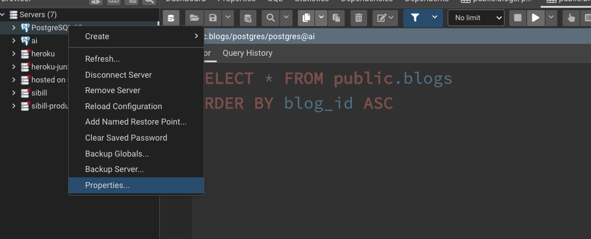
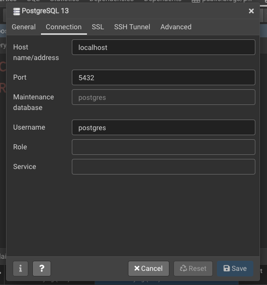

# Homework

- Create blogs table in your local postgres database
- Scrap at least 20 blog entries and insert to blogs table

# How to install packages?

- Create virtual environment
- run pip3 install requirements.txt

# How to connect to the database?

- create .env file in root of your project
- add values depending on your db config




.env file content should be like this

```
DBHOST=localhost
DBNAME=postgres
DBPASSWORD=123456
DBUSER=postgres

```
